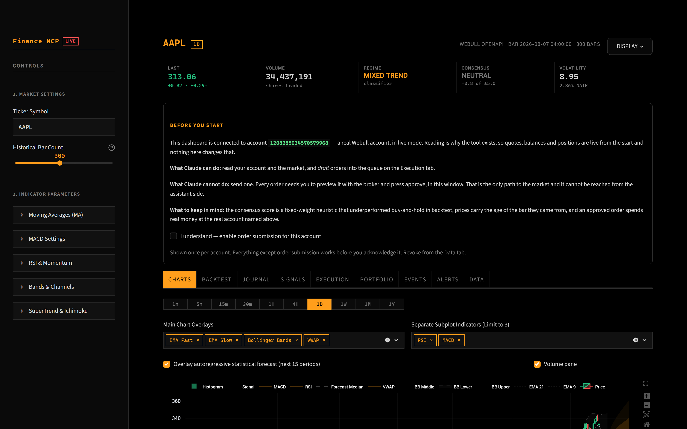

# Installing Finance MCP

Fifteen minutes, most of it waiting for two free API keys to arrive by email.

Windows, macOS and Linux. Desktop alerts use each platform's own notifier —
PowerShell, `osascript`, `notify-send` — and say so plainly if the machine has
none, which a headless server will not.

---

## The short version

```bash
uvx --from 'finance-mcp[dashboard]' finance-mcp-dashboard   # one-off run
# or
uv tool install --with streamlit --with plotly finance-mcp  # keep it around
```

Then put this in your MCP client's config and restart it:

```json
{ "mcpServers": { "finance": { "command": "finance-mcp", "args": [] } } }
```

That is the whole install. The scripted paths below do the same thing plus a
config template, client registration and a Desktop shortcut.

---

## 1. Get the code

**Download a release**, or clone:

```
git clone https://github.com/Blahaj-gif/Finance-mcp.git
cd Finance-mcp
```

## 2. Run the installer

**macOS / Linux:**

```bash
./install.sh
```

**Windows:** double-click **`install.bat`**.

You cannot double-click `installer.ps1` — Windows blocks running a `.ps1` that
way, and there is no setting on the file that changes it. `install.bat` exists
purely to launch the real installer with that block lifted. From a PowerShell
prompt you can run either.

It will:

1. install [uv](https://docs.astral.sh/uv/) if you do not have it,
2. register the server with **every MCP client it finds** — Claude Desktop,
   Claude Code, Cursor, Windsurf — backing up any config it edits,
3. write a `.env` template,
4. put a **Finance MCP Dashboard** shortcut on your Desktop.

It says `INSTALLATION FAILED` if any of that did not work. If you see the
success banner, it worked.

> **No MCP client installed?** That is fine. The server still runs; the
> installer prints the config to paste wherever you need it. See
> [the client table in the README](README.md#works-with-any-mcp-client).

## 3. Fill in `.env`

Where it lives depends on how you installed. Run **`finance-mcp-config`** and it
prints the search order and which file it is actually using — a git checkout
keeps it beside the code, an installed copy uses your per-user config directory,
because site-packages is wiped on upgrade.

| | |
|---|---|
| Windows | `%APPDATA%inance-mcp\.env` |
| macOS | `~/Library/Application Support/finance-mcp/.env` |
| Linux | `~/.config/finance-mcp/.env` |
| Any | `FINANCE_MCP_ENV=/path/to/.env` overrides all of it |

Three entries need you:

```ini
WEBULL_APP_KEY=...        # from Webull's developer portal
WEBULL_APP_SECRET=...
SEC_USER_AGENT=Your Name (you@example.com)
```

**`SEC_USER_AGENT` is not optional if you want filings.** The SEC's fair-access
policy requires a real contact address, and the tools refuse to send a request
without one rather than get the address rate-banned.

`BLS_API_KEY` is optional and free. Without it you get 25 macro queries a day;
[registering](https://data.bls.gov/registrationEngine/) raises it to 500 and the
key arrives by return email. Run the `validate_bls_key` tool afterwards — a
mistyped key does not error, it silently drops you back to 25/day, which only
shows up days later as an exhausted quota.

Leave `WEBULL_ENVIRONMENT=prod`. It is the default on purpose: reading your real
account is the point, and no order can be sent without you approving it.

> **`paper` is not "live data, simulated orders".** It repoints the entire
> client at Webull's sandbox, quotes included, and the sandbox is a separate
> deployment with its own app registry — production keys return `401` there and
> nothing works at all. Use it only with `WEBULL_PAPER_APP_KEY` /
> `WEBULL_PAPER_APP_SECRET`.

## 4. Open the dashboard and read the briefing

Double-click the **Finance MCP Dashboard** shortcut, or run
**`finance-mcp-dashboard`**.



Shown once per account. It names the account you are connected to and states
what the assistant can and cannot do. **Everything except order submission works
before you acknowledge it** — charts, portfolio, filings and macro are all live
immediately. Acknowledging is what enables the approve button.

You can withdraw it later from the **Data** tab, and it will ask again.

## 5. Restart your MCP client

Config is read at startup, so a client that was already running will not see the
server until it restarts. Then ask it something:

> *How does NVDA look on the daily?*

---

## Checking it worked

Ask the assistant to run `check_connection`. It reports whether the feed is
reachable **and how old the newest bar is** — "connected" on its own was the
answer during a real staleness bug, and it answered a question nobody needed.

`get_data_sources` shows every source's configuration and remaining quota,
including which broker environment is live.

## When something is wrong

| Symptom | Cause |
|---|---|
| Assistant does not see the tools | Client not restarted, or the config went to a client you do not use. Check the paths in the README table. |
| `401 UNAUTHORIZED` on everything | `WEBULL_ENVIRONMENT=paper` with production keys. Set it back to `prod`. |
| Filings tools refuse to run | `SEC_USER_AGENT` is unset. This is deliberate. |
| `Daily request cap ... reached` | BLS's 25/day unregistered limit. Get the free key. |
| Prices work, account tools do not | Webull keys missing or wrong; prices fall back to Yahoo, the account has no fallback. |
| Dashboard opens but the chart is empty | Look at the error above the chart — it names the source and the reason rather than showing a blank. |
| Keys are filled in but tools say "not set" | You edited a different `.env` than the one in use. Run `finance-mcp-config`. |
| Alerts never appear on Linux | No notification daemon. Install `libnotify-bin`; on a headless box there is nothing to show them and alerts are recorded in `alerts.json` instead. |

## Uninstalling

`uv tool uninstall finance-mcp`, or delete the folder for a checkout. Then
remove the `"finance"` entry from your MCP client's config, and the per-user
config directory if you used one (`finance-mcp-config` prints the path).
